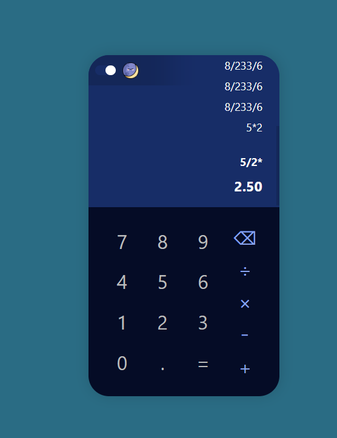
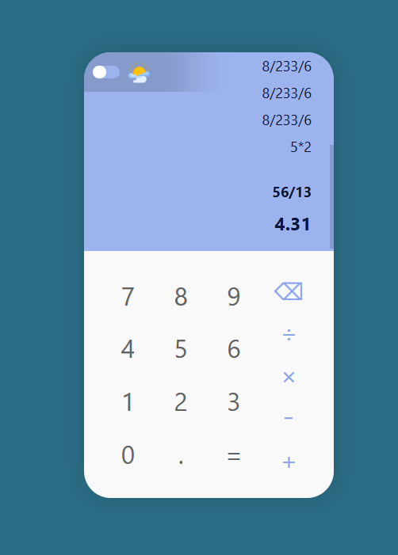

# Calculator using React

## Description

This is a simple calculator application built using React.js. It allows users to perform basic arithmetic operations such as addition, subtraction, multiplication, and division.

## Installation

```bash
# Clone the repository:
git clone https://github.com/888Shubham/calculator-using-React.git

# Navigate into the project directory:
cd calculator-using-React

# Install dependencies:
npm install
 Start the development server and view the calculator:
npm start

# Open http://localhost:3000 in your web browser to use the calculator.
# Contributions are welcome. If you'd like to contribute to this project:
# - Fork the repository
# - Create a new branch
# - Make your changes
# - Submit a pull request
```
## Screenshots


